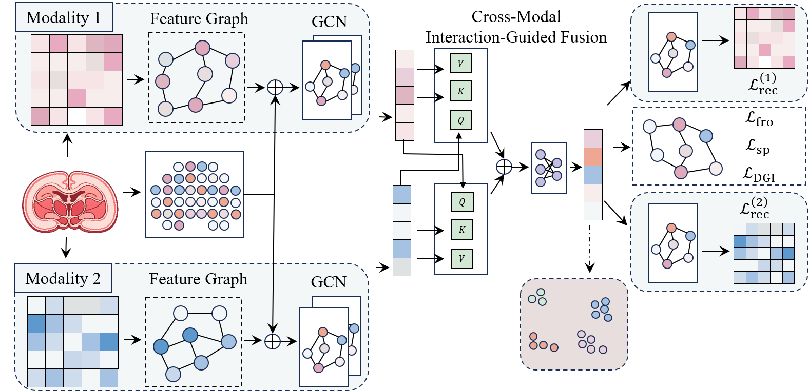

# SPAMO: Spatial Multi-Omics Integration via Dual-Graph Encoding and Cross-Modal Interaction

SPAMO is a deep learning framework for spatial multi-omics integration and spatial domain identification. It learns clustering-oriented representations from paired or triplet spatial omics modalities by combining dual-graph encoding, cross-modal interaction-guided fusion, feature-graph refinement, and self-supervised structural regularization.

This repository is a clean release that keeps the core implementation, a single best-parameter reproduction script, and the final result files for three benchmark datasets.

## Overview



### Abstract

**Motivation:** Spatial multi-omics technologies enable the joint measurement of complementary molecular modalities within intact tissues, providing new opportunities to characterize cellular heterogeneity and spatial organization *in situ*. However, integrating heterogeneous modalities for unsupervised clustering and spatial domain identification remains challenging because of modality-specific noise, heterogeneous feature structures, and the need to preserve spatial context. Existing methods often rely on coarse fusion strategies or insufficient structural constraints, limiting their ability to capture cross-modal dependencies and maintain coherent latent organization. To address these challenges, we propose **SPAMO**, a spatial multi-omics integration framework that combines dual-graph encoding, cross-modal interaction-guided fusion, feature-graph refinement, and self-supervised structural regularization for clustering-oriented representation learning.

**Results:** We evaluate SPAMO on benchmark datasets including Human Lymph Node, Mouse Brain, and simulated multi-modality settings. Across these datasets, SPAMO shows improved performance over strong baselines on the main clustering metrics and achieves competitive results across diverse settings. These results suggest that combining dual-graph encoding, cross-modal interaction, and structural regularization is an effective strategy for spatial multi-omics integration.

## Method Summary

SPAMO is designed for spatial multi-omics data such as RNA+ADT, RNA+ATAC, and simulated RNA+ADT+ATAC settings. Given preprocessed spatial omics matrices and spatial coordinates, the model constructs modality-specific graphs, learns latent representations with graph encoders, aligns and fuses modalities through cross-modal interaction, and optimizes the representation for downstream clustering.

Key components:

- **Dual-graph encoding:** SPAMO encodes modality-specific feature structure and spatial neighborhood information through graph-based neural encoders.
- **Cross-modal interaction:** The model learns interaction-aware fusion weights to combine complementary modalities while reducing the impact of modality-specific noise.
- **Feature-graph refinement:** Feature-level transformations and graph propagation refine modality representations before fusion.
- **Self-supervised structural regularization:** DGI-style self-supervision and spatial regularization encourage coherent latent organization and preserve spatial context.
- **Clustering-oriented representation learning:** The final fused embedding is clustered with `mclust` for spatial domain identification.

## Repository Structure

```text
SpaMO-clean/
├── README.md
├── run.sh                         # Reproduce best configurations and evaluate results
├── main.py                        # Main entry point: load data, train, cluster, write labels
├── cal_matrics.py                 # Evaluation script
├── metric.py                      # Original metric utilities
├── requirements.txt
├── model/
│   └── overview.png               # Model overview figure
├── spamo/
│   ├── __init__.py
│   ├── model.py                   # Two-modality model
│   ├── model_3m.py                # Three-modality model for Simulation
│   ├── trainer.py                 # Two-modality training loop
│   ├── trainer_3m.py              # Three-modality training loop
│   ├── preprocess.py              # Two-modality preprocessing and graph construction
│   ├── preprocess_3m.py           # Three-modality preprocessing and graph construction
│   └── utils.py                   # Clustering and utility functions
├── Data/
│   ├── README.md
│   ├── HLN/
│   ├── Mouse_Brain/
│   └── Simulation/
└── results/
    ├── best/                      # Included best labels and metrics
    └── HLN/                       # Example output from a direct run, if generated
```

## Data Availability

For all datasets required for the experiments, you can obtain the data from [Google Drive](https://drive.google.com/file/d/1WMFi6AE6I07uwFDr0bD29_F3rTAkTIno/view?usp=sharing).

Data and scripts for experiments reported within this paper are also available at [Zenodo record 20160187](https://zenodo.org/records/20160187).

After downloading, place the data under `Data/` with the following layout:

```text
Data/
├── HLN/
│   ├── adata_RNA.h5ad
│   ├── adata_ADT.h5ad
│   └── GT_labels.txt
├── Mouse_Brain/
│   ├── adata_RNA.h5ad
│   ├── adata_peaks_normalized.h5ad
│   └── MB_cluster.txt
└── Simulation/
    ├── adata_RNA.h5ad
    ├── adata_ADT.h5ad
    ├── adata_ATAC.h5ad
    └── GT_1.txt
```

The current clean working directory may already contain these datasets under `Data/`. For a public GitHub release, large `.h5ad` files should usually be excluded from git and provided through the links above.

## Installation

The experiments were run in a conda environment named `ST` on Python 3.12. Use the provided `environment.yml` to recreate the environment:

```bash
conda env create -f environment.yml
conda activate ST
```

## Quick Start

Run all three best-parameter experiments and evaluate clustering metrics using `run.sh`:

```bash
conda activate ST
bash run.sh
```

Outputs are written to:

```text
results/HLN/
results/Mouse_Brain/
results/Simulation/
```

## Citation

If you use this code or data, please cite the corresponding paper and data resources.

```bibtex
@misc{spamo,
  title = {SPAMO: Spatial Multi-Omics Integration via Dual-Graph Encoding and Cross-Modal Interaction},
  note = {Data and scripts available at https://zenodo.org/records/20160187}
}
```

## License

Please follow the license terms of the original codebase, datasets, and third-party dependencies.
